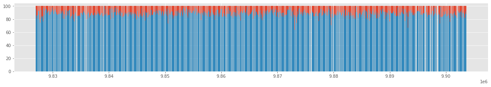
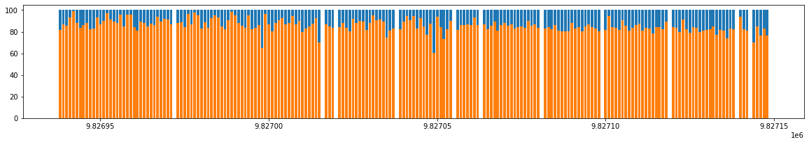
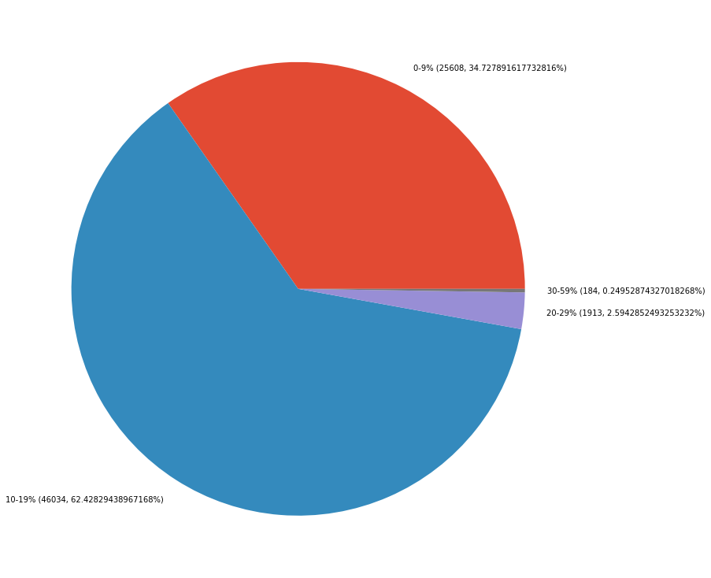
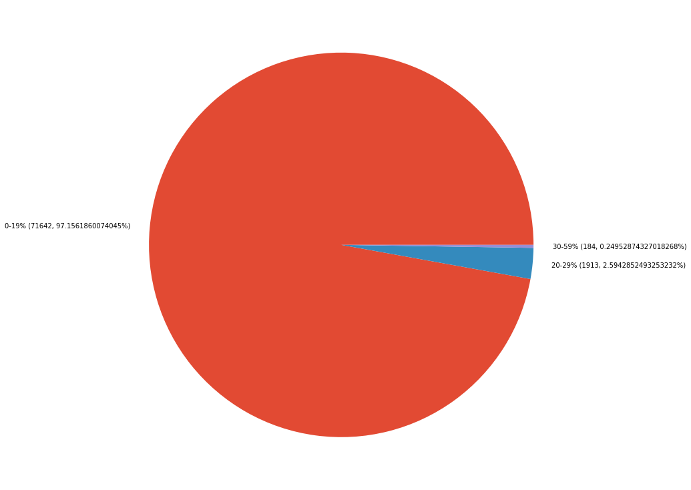

# Chunks cost analysis

## Introduction

In [a document posted by
Vitalik](https://notes.ethereum.org/@vbuterin/code_chunk_gas_cost), it is
proposed to add a gas cost charge for accessing code chunks, the document
proposes a cost of `350` gas for accessing a chunk, where each chunk is `31`
bytes long.

In this document, this additional cost for accessing cost is analyzed using the
infrastructure developed for [Code Merkleization
PoC](https://blog.ethereum.org/2021/04/26/ef-supported-teams-research-and-development-update-2021-pt-1/#code-merkleization).
The geth node was modified to also log the number of chunks accessed in a block
execution along with the information about proof sizes. In this analysis the
code is split into chunks of 32 bytes. 

## Results

73739 blocks were analyzed, from block `9826938` to `9903677`.

### Gas Usage

|                |          |
|----------------|----------|
|Average gas used| 8,905,782|
|Minimum gas used|    13,972|
|Maximum gas used| 9,999,999|

### Accessed Code Chunks

|                       |          |
|-----------------------|----------|
|Average accessed chunks|      3304|
|Minimum accessed chunks|         6|
|Maximum accessed chunks|     10315|

### Chunks's access cost

Considering `350` gas per accessed chunk:

|                |          |
|----------------|----------|
|Average gas cost|1156499.9 |
|Minimum gas cost|2100      |
|Maximum gas cost|3610250   |

### Block Gas Reduction

The following chart shows how much gas would be reduced from the block by
charging `350` for each accessed code chunk:

Here is a much smaller sample with only 200 blocks:

Indicating the average gas reduction is about 20%. Which we confirm by
analyzing the data in more detail, we get the following information:

Gas Reduction:

|Gas reduction %|Total Contracts| % contracts|
|---------------|---------------|------------|
| 0-9%          | 25,608        | 34.72%     |
| 10-19%        | 46,034        | 62.42%     |
| 20-29%        |  1,913        |  2.59%     |
| 30-39%        |    175        |  0.23%     |
| 40-49%        |      8        |  0.01%     |
| 50-59%        |      1        |  0.0013%   |
| 60-100%       |      0        |  0.00%     |

We can see the majority of the blocks get reduced its gas limit by 0-19%:

